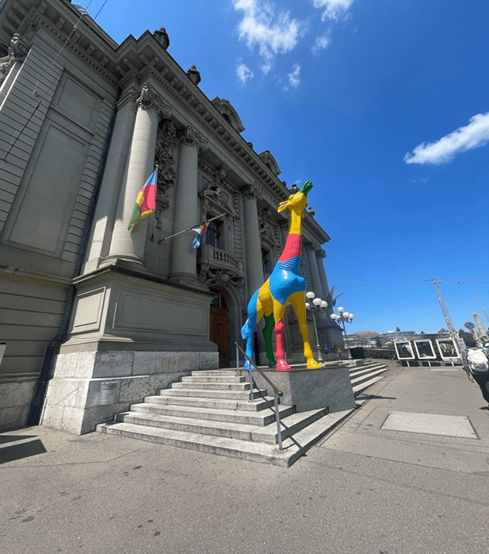
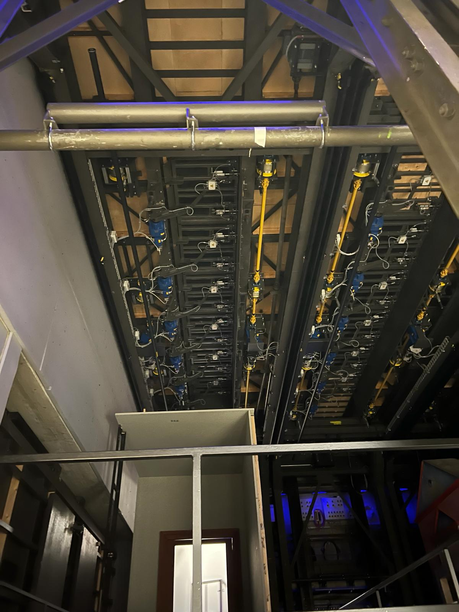

+++
title = "Im Schatten des Applauses"
date = "2024-02-27"
draft = false
pinned = false
image = "bild1.png"
description = "\n"
+++
 Das Berner Stadttheater ist nicht nur ein Kulturhaus, in dem der Applaus täglich den Saal erfüllt, sondern auch ein Ort der Teamarbeit und grossem Aufwand. Ein Gang bis tief in die Keller der Bühne Bern, ermöglicht einen Einblick in die Vielfalt und Schönheit der kulturellen Veranstaltungen. Hier sieht man genaue Prozesse und Eindrücke in die verschiedenen Produktionen, die zusammen ein Theaterstück ergeben.

Arwen Eisenegger, Yara Daumüller 

Mitten in der Altstadt steht sie, die Bühne Bern. Von weitem erkennt man einen Farbfleck. Die Giraffe, die vor den Eingangstoren wacht. Es scheint fast so, als würde sie die abendli-chen Zuschauer*innen bereits erwarten. Hinter ihr befinden sich die schweren, alten Eingangstüren aus dunklem Holz die beim Eintreten des Kulturhauses mächtig wirken. Kaum hat man das Gebäude betreten beginnt eine Reise tief ins Innere des Theaters und der Kunst dahinter.

**Eine andere Seite des Theaters**
Statt wie alle Zuschauer*innen den Saal der Aufführungen zu betreten, gehen die Mitarber*\*\*innen in eine komplett andere Richtung. Sie gehen auch in ein Theater, nur nicht in die Vorstellung, sondern in den Prozess. Der Kontrast zwischen zwei Räumen, die nur durch eine Tür getrennt werden, ist überwältigend. Von einem modernen, weissen Raum mit viel Licht, tritt man in ein altes klappriges Treppenhaus. 

Eine der Mitarbeiterinnen ist Fabienne Biever, Dramaturgin und Theaterpädagogin, sie verwendet diese Treppe fast täglich. Die 49-jährige Mutter von drei Kindern arbeitet seit 2020 an der Bühne Bern. Ihre lange Erfahrung der Dramaturgie macht sich direkt bemerkbar, wenn sie beginnt von ihrer Passion zu erzählen. Fabienne ist nicht nur Pädagogin, sondern, sie schreibt auch ihre eigenen Stü-cke, die schon auf der Bühne Bern performen durften. Mit ihrem Know How und Liebe zum Theater selber, ist sie die Frau, die einen sehr breiten und tiefen Einblick hinter die Kulis-sen mit am besten ermöglichen kann. 

**Ein Haus, hundert Welten**
Das Knarzen der Holzböden ertönt in den eher ungemütlichen Gängen. Eine Tür auf der rechten Seite des Ganges ermöglicht den Eintritt in einen verwunderlich hellen Raum. Durch die Flut des Lichtes kann man hier den Staub in der Luft schweben sehen, es ist still. Zwei Gesichter blicken hinter den Regalen durch, sie sehen konzentriert aus. Beschäftigt sind sie mit der Herstellung von Perücken für die nächste Aufführung. Haar für Haar wird mit einer speziellen Nadel in die künstliche Kopfhaut geführt. Eine Geduldsarbeit. Die Grössen der Perücken nehmen sie von handgefertigten Gipsköpfen die von allen Darsteller\*innen vorhanden sind.
Wenn man nun den Raum wieder verlässt und durch das Treppenhaus hinunter geht, gelangt man direkt unter die Bühne. Dies ist ein Ort der Ruhe, wieder einmal trifft man auf viele Türen, die sicherstellen, dass Lärm sich nicht schnell verbreitet. Eine nächste Tür ist mit einem roten Licht ausgestattet, wenn es an ist, darf man auf keinen Fall reden, denn wer durch diese Tür eintritt, steht direkt unter der Bühne. In immer nur kleinen Abschnitten geht es weiter bis die nächste Tür folgt, um Geräusche möglichst gut zu kaschieren. Elektriker\*innen und Verantwortliche für Ton und Licht gehen ein und aus. Hier ist der Gang dunkel und voller kleiner blinkender Lichter.
Mit dem Lift geht es dann ganz nach oben. Dort gelangt man in einen langen Gang. Nach ein paar Schritten bildet sich auf der linken Seite ein Raum. Der Pausenplatz für die Schauspielerinnen. An der weissen Wand hängt ein Fernseher, der den aktuellen Auftritt zeigt, damit alle, die noch nicht gerade auftreten müssen, wissen, wann sie an der Reihe sind. Momentan ist der Raum nicht besetzt, man sieht nur zwei Putzkräfte, die zusammen an einem der schwarzen Tische ihre Kaffeepause halten.
Weiter entlang dem Gang geht man an vielen Kleiderständern voller bunter Kostüme vor-bei. Wieder auf der linken Seite ist der Vorbereitungsraum für die Tänzerinnen. Auf allen Seiten stehen Tische aneinander und darüber sind Spiegel mit Lichter, wie man sie aus Hollywood Filmen kennt. Die Lichter geben dem Raum ein warmes Gefühl und je länger man dort drinnen bleibt, desto mehr fühlt man sich selbst wie ein Teil der Show. Auch hier werden die Tänzer*innen nicht nur geschminkt, sondern auch bekleidet, wie man an den Kostümen im hinteren Teil des Raumes sieht.

**Kunst verborgen hinter Türen**
Wenn man diesem Gang nun noch ein paar Schritte weiter folgt, gelangt man an einen Ort, der tief fasziniert. Die Requisitenwerkstatt. Um ein Theater so lebhaft wie möglich zu gestalten, braucht man eines sehr dringend: Requisiten. Überall stehen hier Dinge herum, die später irgendeine Rolle in einem Theaterstück übernehmen werden.Zuerst kann man den Raum wegen zu vielen Sinneseindrücken nicht richtig einschätzen und man ist verloren im Chaos. Es steht viel Unfertiges herum, welches zum Teil zu nichts zu gehören scheint. Jedoch ergibt alles immer mehr Sinn, wenn man nur genau hinsieht. Das grüne Plastikstück auf dem Arbeitstisch wird später zu einem Pflanzenblatt der Monstera, die ein paar Meter weiter wegsteht. Das eben beschriebene Gefühl geht schnell vorbei, denn wenn man genau hinsieht, hat alles hier eine Aufgabe. 
Im hinteren Teil des Raumes steht eine Wendeltreppe, die zu einer kleinen Holztüre führt. Fabienne geht voraus und öffnet sie. Man kommt in einen langen,vollgestopften Gang, alles voll mit den verschiedensten Requisiten. Hier stehen Taschen, plastik Orangen, XXL Teebeutel, Kuchen und vieles mehr. Auf die Frage, wie eine so grosse Masse an verschie-denen Dingen überhaupt zusammenkommen kann, meint Fabienne, dass sie hier im Re-quisitenlager hauptsächlich gebrauchte Dinge haben. Diese kommen von verschiedenen Brockis, von den Mitarbeiter*innen selbst oder von Flohmärkten.

*“Natürlich gibt es auch Sachen, die spezifisch gebraucht werden und die man nicht eben so schnell in einer Brocki findet. Diese Dinge werden neu gekauft”. (Fabienne Biever)*

Es gibt noch zwei weitere solche Räume, die Requisiten lagern, sie grenzen direkt aneinander an. Ein nahezu unendlicher Gang, voll mit den verschiedensten Dingen. Wenn die nächste Türe wieder auftaucht und man sie öffnet, stolpert man in eine ganz andere Welt. Hier ist es nicht staubig und eng, nein, hier ist ein grosser eleganter Gang mit weinroten Wänden und versetztem Holzboden. Im Gang stehen ausserdem elegante Holzbänke mit weissen Polsterkissen. Von hier aus ist man nur ein paar Schritte vom alten Teesalon entfernt. Heute ist er auch eine Art Aufenthaltsraum, nur ist er jetzt für alle zugänglich. Früher war es hier nicht möglich, dass sich Leute aus den mittleren und unteren Schichten hier aufhalten konnten. Hier gab es nur Platz für die Elite, die es gut vermochte ein wenig mehr zu zahlen. Genau diese Treppe, welche den Zugang zu diesem Salon und allgemein der oberen Etage ermöglicht, zeigt noch einmal, wie wunderschön das Kulturhaus von Innen ist, bevor man über die eleganten Steintreppen wieder runter ins Foyer schlendert.

 Infokasten:
Das Stadttheater Bern existiert bereits seit 1903. Neben dem Stadttheater betreibt die Bühne Bern seit 2007, auch drei weitere Bühnen in den Vidmarhallen in Köniz. Das Kulturhaus ist nicht nur ein Ort der Dramaturgie, nein, es vereint Oper, Schauspiel, Ballett und das Berner Sympho-nieorchester unter einem Dach In dem 121-jährigen Ge-bäude wird fast täglich etwas vorgeführt. 

Wenn man nun durch die schwere Holztüre wieder ins Freie tritt, erkennt man vor der Büh-ne Bern die grosse Giraffe, die im Winter einen Schal trägt. Eine Treppe führt zur Strasse und ein kalter Wind weht. In ein paar Stunden werden hier die Menschen die Giraffe kreuzen und in das Gebäude treten, um eine Aufführung zu besuchen, jedoch nicht wissen, was in all den Räumen hinter der Bühne geschieht.