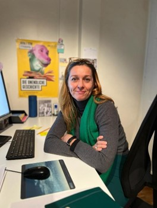

+++
title = "Von der Bühne weg"
date = "2024-02-27"
draft = false
pinned = false
image = "bild2.jpg"
description = "\n\nInfokasten\nName: Fabienne Biever\nAlter: 49 Jahre\nBeruf: Theaterpädagogin, Dramaturgin, Regisseurin\n"
+++

Die Bühne Bern ist bekannt für ihre faszinierenden Aufführungen. Alles, was uns als Zuschauer*innen unterhält, geschieht auf ihr, der Bühne. Beeindruckend ist aber nicht nur das Geschehen auf der Bühne, sondern auch was dahinter geschieht.

Arwen Eisenegger und Yara Daumüller

In einem kleinen Raum in der Nähe der Bühne Bern. Hier hat Fabienne Biever ihr Büro. Sie ist Theaterpädagogin, Dramaturgin und Regisseurin. Nachdem sie sich auf ihren Bürostuhl gesetzt hat, setzt sie ihre Brille auf und schaut mit erwartungsvollem Blick in den Raum. Ihre grünen Stoffhosen passen mit dem farblich abgestimmten Schal überein. Eine Rote Kette sticht über Fabiennes grauem T-Shirt hervor. Sie rollt mit ihrem Stuhl hinter dem Bürotisch hervor. Mit einem freundlichen Lächeln beginnt sie zu erzählen.

**Wie werden Theaterstücke gehandhabt, gibt es eine spezielle Abfolge, die eingehalten wird?**

Zwei Dramaturginnen, der Schauspieldirektor und ich arbeiten das ganze Jahr über als Team und besprechen, welche Stoffe interessant für die Stadt sind. Wir schauen, was die Gesellschaft interessiert und was viel gelesen wird.
Ich darf vor allem für Kinder- und Jugendstücke mitentscheiden. 

**Die Bühne Bern ist sehr gross, werden auch selbst geschriebene Stücke veröffentlicht?**

Ja, letztes Jahr hat die Bühne Bern einer Schweizer Autorin einen Auftrag gegeben. Das Stück hiess „Bestien wir Bestien“ und wurde der Bühne Bern zugeteilt. Noch ein Jahr zuvor gab es noch einen Auftrag der hiess „der Sennentuntschi“. Grundsätzlich gibt es ein paar Auftragsarbeiten, aber so ein Stück schreibt sich nicht so schnell. Wenn es einen solchen Auftrag gibt, dann wird das Stück sicher erst im nächsten Jahr veröffentlicht.
Dieses Jahr haben wir kein solches Stück aber dafür kommt „die Dampfnudel“ heraus. Die Geschichte wurde in einer Zusammenarbeit mit Basel geschrieben. Das Ziel dabei ist, dass junge Autor*innen die Möglichkeit erhalten ein Stück zu schreiben und das gemeinsam mit Regisseur*innen der Bühne Bern.
Mit dieser Möglichkeit können diese jungen Menschen auch bekannt werden und sind es auch.

**Das Stadttheater Bern erhält nicht immer nur Positive Feedbacks, gerade mit den Übergriffen die 2022 an die Nachrichten gelang, wie geht dir Bühne Bern damit um?**

Also wir sind ein Team von 550 Mitarbeiter\*innen und grundsätzlich muss ich sagen, dass ich mich persönlich nicht so gut mit dem Thema auskenne. Klar betrifft es mich und es macht mich auch nachdenklich. Ich finde es aber auch schade, wenn ich sehe, dass das Theater in Verruf gerät, wenn so viele Menschen so viel Herzblut in die Arbeit stecken.
Es gibt immer zwei Seiten der Medaille. Wenn ehemalige Direktor\*innen einen Shitstorm auslösen macht mich das auch sehr traurig und man muss sich auch überlegen wann, wie, was. Und gerade wenn Mitarbeiter*innen unter dem Arbeitsklima leiden, dann ist es sicher gut, wie das Theater darauf reagiert. 

**Budget, haben Sie Sponsoren oder sind das nur die Einnahmen der Kassen?**

Also das meiste Geld fliesst durch öffentliche Subventionen von der Stadt. Das kommt dann etwa auf 70 Millionen. Alleine durch das reicht es aber noch nicht, es gibt immer noch private Sponsoren. Es ist aber nicht möglich gewinnbringend zu führen, deshalb müssen wir auch immer Dinge zeigen, die funktionieren, um dort keine Verluste zu machen. Und die Kürzungen wurden schon gemacht, in allen Kulturhäusern werden diese als erstes durchgeführt. Das ist der Ort, wo man am meisten spart. Ich finde Kunst ist eine Freiheit und muss eine Austauschmöglichkeit sein. Gesellschaftskritische Dinge sollten dabei Platz haben und alle müssen die Möglichkeit haben, an diese Kunst zu gelangen. Ich finde Kunst sollte der Ort sein, in dem am wenigsten gespart wird.

**Wie werden die Kleider hergestellt oder geschaffen?**

Wir haben in den Vidmarhallen ein Lager von etwa 30‘000 Kleidern aus allen Zeitepochen. Bei uns wird nichts weggeworfen, ausser die Kleider sind völlig an ihrem Lebensende angelangt. Die Kleider werden von unserer Schneiderei hergestellt, moderne Kleider werden aber oft auch neu gekauft oder in Brockis und Second Hand.

**Durchschnittliche Zeit einer Probe und der Ablauf?**

Also, die Planung an sich beginnt schon ein Jahr vorher mit dem Bühnenbild, den Requisiten und sogar schon von den Kostümen. Der Beginn der Proben dauert dann meistens sechs Wochen, manchmal etwas länger, aber eher selten. Zuerst wird immer alles genau geplant und besprochen, bevor dann die Proben richtig losgehen.

**Das Theater verliert immer mehr an Popularität, wie geht die Bühne Bern damit um?**

Die Befürchtung, dass nur noch ältere Menschen in das Theater gehen, ist natürlich da. Bei der Oper ist es sicher der Fall, dass nur noch ältere Menschen diese besuchen, weil es auch anspruchsvoll ist, sich drei Stunden hinzusetzen und der Oper zuzuhören. Auch ein Theater kann anspruchsvoll sein, gerade mit der Sprache, was jungen Menschen vielleicht nicht sehr gefällt. Die Bühne Bern ist da aber sehr Kinder und Jugendfreundlich. Wir bieten viele Stücke für ganz kleine bis zu Erwachsenen an. Das Theater ist für junge Menschen, ist aber offen für alle.



Infokasten
Name: Fabienne Biever
Alter: 49 Jahre
Beruf: Theaterpädagogin, Dramaturgin, Regisseurin

